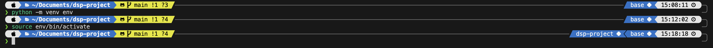

# Digital Signal Processing Project

## Python!

### Python Virtual Environment

Install the python virtual environment package:
`pip install virtualenv`

#### Initialize a python enviroment in your project folder (using Python venv)

`python<version> -m venv <virtual-environment-name>`

Example (based on linux):
```
mkdir projectA
cd projectA
python3.8 -m venv env
```

Here, we are creating a virtual environment using python3.8 and naming it `env`.

#### Initialize a python environment using Conda

Creation of the environment

conda create -n test_env python=3.6.3 anaconda
Some explanation of the documentation of conda create is not clear:

-n test_env sets name of the environment to test_env

python=3.6.3 anaconda says that you want to use python in version 3.6.3 in this environment (exactly the one you have, and you can use a different one if you need it) and package anaconda. You can put all the things you need there, separated with spaces, e.g., sqlite matplotlib requests and specify their versions the same way as for python.

Activation

conda activate test_env
Deactivation

conda deactivate
Getting rid of it

conda remove -n test_env --all

#### Activating the virtual environment

For Linux (Ubuntu/MacOS) users:
`source env/bin/activate`

For Windows users:
```
env/Scripts/activate.bat //In CMD
env/Scripts/Activate.ps1 //In Powershel
```


> Notice how after we activate the environment, there is an indicator "dsp-project" that will pop up showing that we are indeed in __our__ "environment"


## Create a `requirements.txt`

This creates a list of all the libraries used in the environment which is essential for making this project portable and makes it easy for other members of the project to stay in sync. This is kind of like a package manager (similar to Maven in Java or NPM in JavaScript).

`pip freeze > requirements.txt`

## To install the required libraries (from a `requirements.txt`)

`pip install -r requirements.txt`

## Deactivate the environment

`deactivate`
